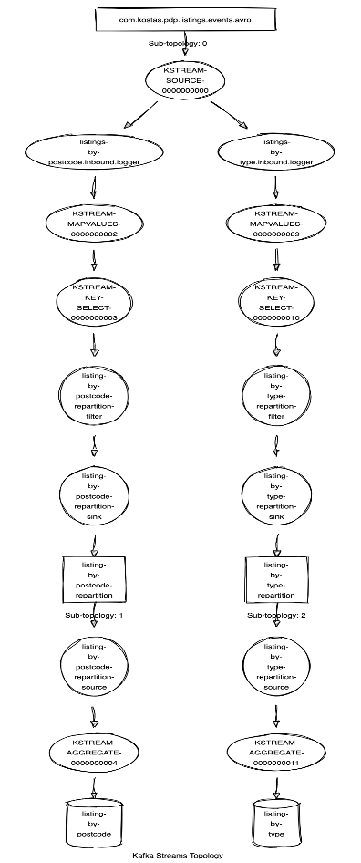

# Kafka Streams Application

Spring Boot application using [Kafka Streams](https://kafka.apache.org/documentation/streams/) that gets an input of public listed properties around London, process and store them into two different state stores, by postcode and by property type.

There are also two /GET requests implemented that return the results of the data processed and stored to the end user.

## Topology



## Prerequisites

```
Docker
```

### Installing

Download or Clone project from GitHub. Open preferably on an IDEA

### Running the application

First you will need to fire up kafka by executing the below command on the project folder

```
docker-compose -f kafka.yaml up 
```
Run Spring Boot Application with adding the local.env file to the boot configuration.

There are two env files to declare two separate instances of the appication. The first is running on port 8080 and the second on 8083.

After successfully run the application the kafka initializer is loading a pre-settled set of data to the listings topic.

On a browser you can test the results returned to user by using the REST endpoints. Examples:

```
http://localhost:8080/listings/postcode/SW10
http://localhost:8080/listings/property_type/flat
```


### Testing

[Embedded Kafka](https://docs.spring.io/spring-kafka/api/org/springframework/kafka/test/context/EmbeddedKafka.html) used to run a lightweight kafka for testing purposes and test the functionality of kafka and its configuration along with unit tests that cover the main code functionality.

