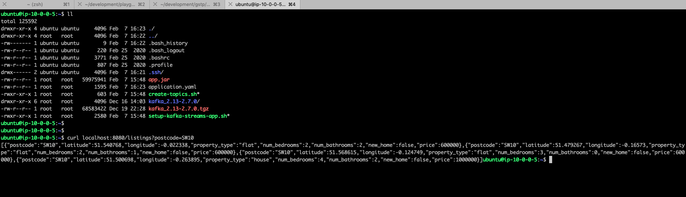
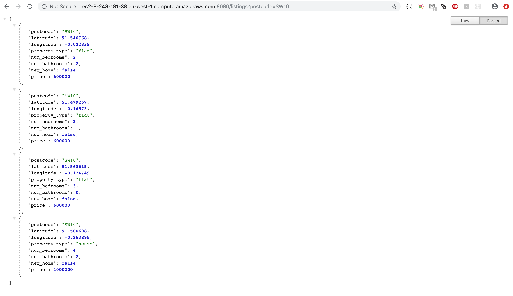
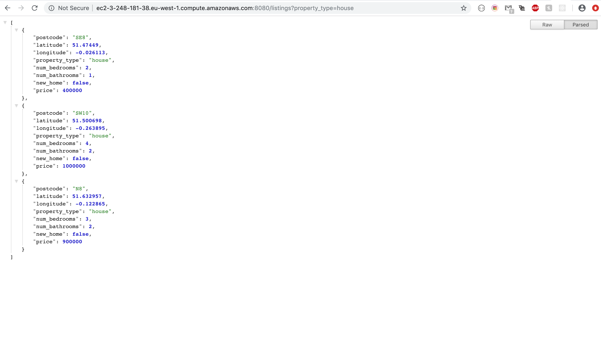

# CDK TypeScript project to deploy kafka streams app to AWS

The `cdk.json` file tells the CDK Toolkit how to execute your app.

## Screenshots from the app running into AWS

Curl the API inside the EC2:

Remote call from public IP to getByPostcode topic:

Remote call from public IP to getByType topic:

## Useful commands

 * `npm run build`   compile typescript to js
 * `npm run watch`   watch for changes and compile
 * `npm run test`    perform the jest unit tests
 * `cdk deploy`      deploy this stack to your default AWS account/region
 * `cdk diff`        compare deployed stack with current state
 * `cdk synth`       emits the synthesized CloudFormation template
